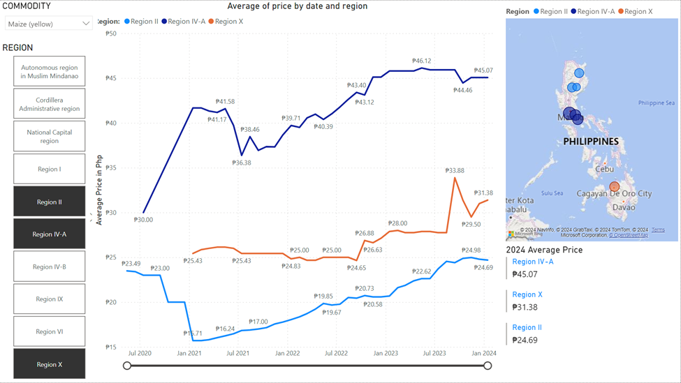

# Power BI Project: Philippines Commodity Price Analysis

## Overview

This Power BI project provides a dashboard of the average prices of commodities across different regions in the Philippines. The report includes interactive features such as dropdown filters for regions and commodities, allowing users to explore the trends over time. Additionally, a map visualization with bubbles represents the current average price of commodities for the year 2024.

## Features

### 1. Interactive Filters

#### Commodity Filter
- Select commodities of interest from the dropdown list.
- Compare and study the price trends for the selected commodities.

#### Region Filter
- Use the tile menu to select one or multiple regions.
- Analyze the commodity prices specific to the chosen regions.

### 2. Time Trend Analysis

- The report provides a time series analysis, enabling users to observe how commodity prices evolve over time.
- Multiple regions can be selected simultaneously, allowing for a comparative analysis of trends.

### 3. Map Visualization

- A map with bubbles is included to visually represent the current average price of commodities for the selected year.
- Bubbles on the map indicate the average price magnitude, providing an overview of the regional price distribution.

## Getting Started

1. Clone this repository:

    ```bash
    git clone https://github.com/valpaulo/PH_Commodities_Prices
    ```

2. Open the Power BI project file (`PH Commodities Prices Power BI Project.pbix`) using Power BI Desktop.

3. Explore the interactive filters, time trend analysis, and map visualization.

4. Analyze the commodity prices based on your selected filters and regions.

## Data Source

The data for this project is sourced from https://data.humdata.org/dataset/wfp-food-prices-for-philippines, and it includes information on commodity prices across various regions in the Philippines.

## Screenshots


*Time Trend Analysis with Interactive Filters*


*Hovering Map Bubbles will Show 2024 Average Price for that Area*